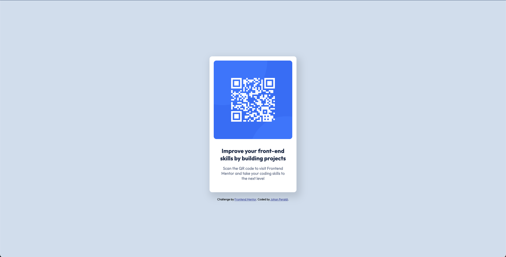

# Frontend Mentor - QR code component solution

This is a solution to the [QR code component challenge on Frontend Mentor](https://www.frontendmentor.io/challenges/qr-code-component-iux_sIO_H). Frontend Mentor challenges help you improve your coding skills by building realistic projects. 

## Table of contents

- [Overview](#overview)
  - [Screenshot](#screenshot)
  - [Links](#links)
- [My process](#my-process)
  - [Built with](#built-with)
  - [What I learned](#what-i-learned)
  - [Useful resources](#useful-resources)
- [Author](#author)
- [Acknowledgments](#acknowledgments)

**Note: Delete this note and update the table of contents based on what sections you keep.**

## Overview

### Screenshot

> Desktop view:
>
>

>Mobile view:
>
>

### Links

- Solution URL: [GitHub Repository](https://github.com/JohanPeraldi/QR_code_component_FEM)
- Live Site URL: [Vercel](https://qr-code-component-fem-weld.vercel.app/)

## My process

### Built with

- HTML
- CSS
- Love for coding ❤️
- Patience

### What I learned

Even on a very simple project such as this one, there is always something to learn. I initally put a `z-index: -1;` on the footer to avoid it overlapping with the card when the viewport is reduced under a certain height, without realising that this solution would prevent the links from being clicked. Not very smart! I then decided to go with a media query targetting viewports under 640px in height and replace the `z-index` rule with `display: none;`. With that, the footer disappeared completely before reaching the bottom of the card, avoiding it to overlap. But then someone pointed out to me that a better solution would be to remove the absolute positioning from the footer altogether and simply let it occupy its natural place in the flow of the document. This way, it would never overlap the card, no matter the viewport size. I initially wanted to align the footer at the bottom of the viewport, but keeping it right below the card is also a good solution.
>
It's always good to go back to the fundamentals and practice positioning elements with CSS, among other things. Also, making sure that there are no unnecessary scrollbars when playing around with the viewport size can be a bit tricky.

### Useful resources

- [A Complete Guide to Flexbox](https://css-tricks.com/snippets/css/a-guide-to-flexbox/) - Always comes in handy when working with flexbox.

## Author

- Website - Working on it! Coming soon!
- Frontend Mentor - [@ioan](https://www.frontendmentor.io/profile/JohanPeraldi)

## Acknowledgments

I want to thank my code editor, VS Code, without which I would probably not be here today, as well as GitHub Copilot for helping me out with this challenge as it has with so many other projects. You guys are awesome! I also want to thank the Frontend Mentor community for providing me with the opportunity to practice my skills and learn new things.